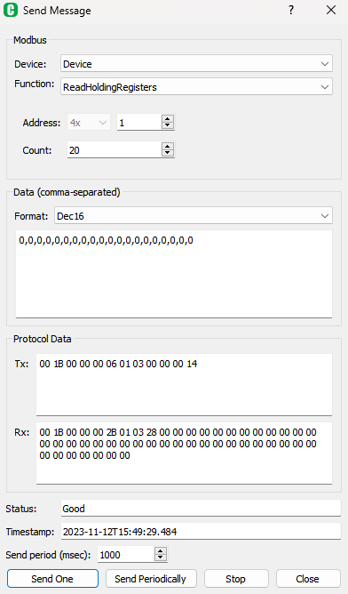

# Modbus Tools

## Overview

ModbusTools are cross-platform (Windows, Linux) Modbus simulator tools (client and server) with GUI to work with standard Modbus Protocol. Modbus Tools are a free, open-source  tools with a simple user interface written in C++/Qt. It implements TCP, RTU and ASCII versions of Modbus Protocol.

Software implements such Modbus functions as:
* 1  (0x01) - `READ_COILS`
* 2  (0x02) - `READ_DISCRETE_INPUTS`
* 3  (0x03) - `READ_HOLDING_REGISTERS`
* 4  (0x04) - `READ_INPUT_REGISTERS`
* 5  (0x05) - `WRITE_SINGLE_COIL`
* 6  (0x06) - `WRITE_SINGLE_REGISTER`
* 7  (0x07) - `READ_EXCEPTION_STATUS`
* 15 (0x0F) - `WRITE_MULTIPLE_COILS`
* 16 (0x10) - `WRITE_MULTIPLE_REGISTERS`

ModbusTools work with Qt Framework version 5 (5.8 or later).
It based on `ModbusLib` cross platform library project:

https://github.com/serhmarch/ModbusLib

## About Modbus Client

The client implements access to a remote Modbus device. However, the client can work not only with one device, but with several devices that can be connected to a single network, which is especially useful when working with RTU and ASCII protocols, when access to all Modbus servers is realized through a single serial port. However, it can also be useful when using the TCP version of the protocol, for example, if you use the TCP->RTU bridge.

All work is done within a single project. The main entities in the project are Port, Device and DataViewItem. Port contains network settings for both TCP/IP and serial ports. Device contains settings for a single device (such as Modbus Unit Address, etc.).  The DataViewItem contains a single data unit to be read from the remote device and has many formats to represent the current data.

The client has the ability to process one separate Modbus function with full configuration of the parameters of this function, view/edit read/write data with the format specified, view Modbus packets of this function:

This window can be opened using menu `Runtime->Send Message` in run mode. It works in parallel with regular Modbus application messages and can be seen in LogView as regular Modbus message as well.

## About Modbus Server

The server implements Modbus server device and works like Modbus simulator. However, the server can  not only simulate single device, but can simulate several devices that can be connected to a single network, which is especially useful when working with RTU and ASCII protocols, when access to all Modbus servers is realized through a single serial port. However, it can also be useful to simulate Modbus network using the TCP version of the protocol, for example, if you use the TCP->RTU bridge, Modbus server can replace this bridge with remote devices for testing purposes.

All work is performing within a single project. The main entities in the project are Port, Device, DataViewItem and Action. Port contains network settings for both TCP/IP and serial ports. Device contains settings for a single device (such as Modbus Unit Address, memory size etc).  The DataViewItem contains a single data unit to be read/write from the device and has many formats to represent the current data. Action provides simulation capabilities (automatic change of device memory values).

The server has the ability to simulate data (actions, automaticaly change values) with predefined action types (`Actions` tab near `LogView`, menu `View->Actions` window and menu `Actions`):
* `Increment` - changing value by adding or subtracting (if incrementValue < 0) incrementValue
* `Sine` - sine function with parameters of period, shift, amplitude
* `Random` - randomly changing values with specified range

## Binary

Modbus Tools binary using Qt5.8 version of the framework or later. 
Modbus Tools was compiled for Windows 64 bit and Ubuntu 22.04.
Binary files are located in <root>/bin/

## Build

Build intructions is located in `bin` folder, e.g. `./bin/Ubuntu/README.md`

